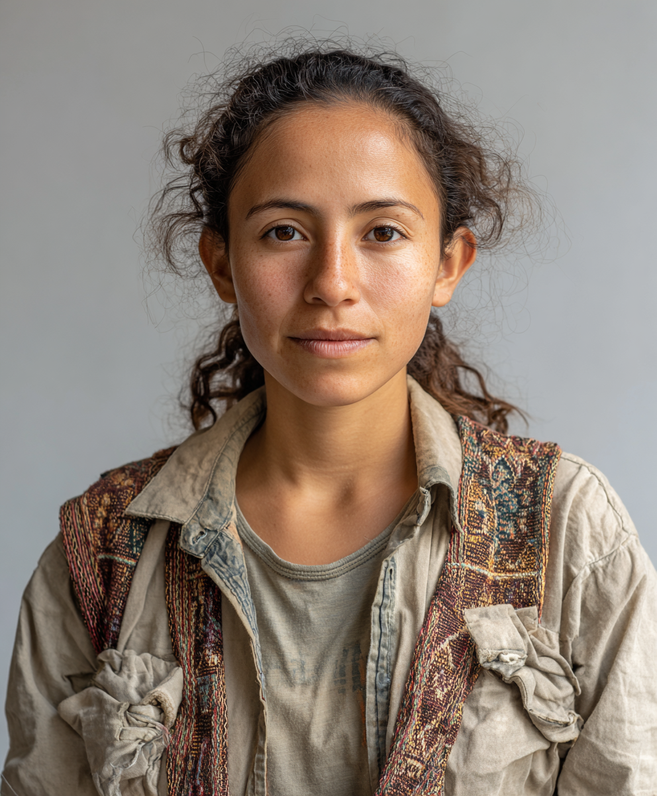
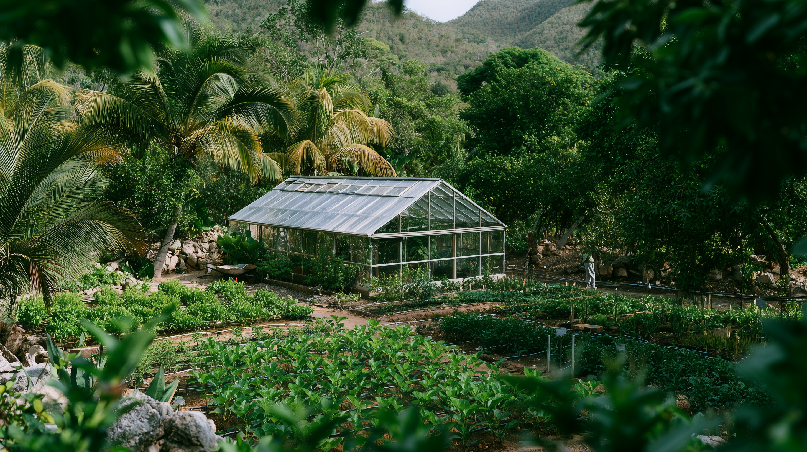
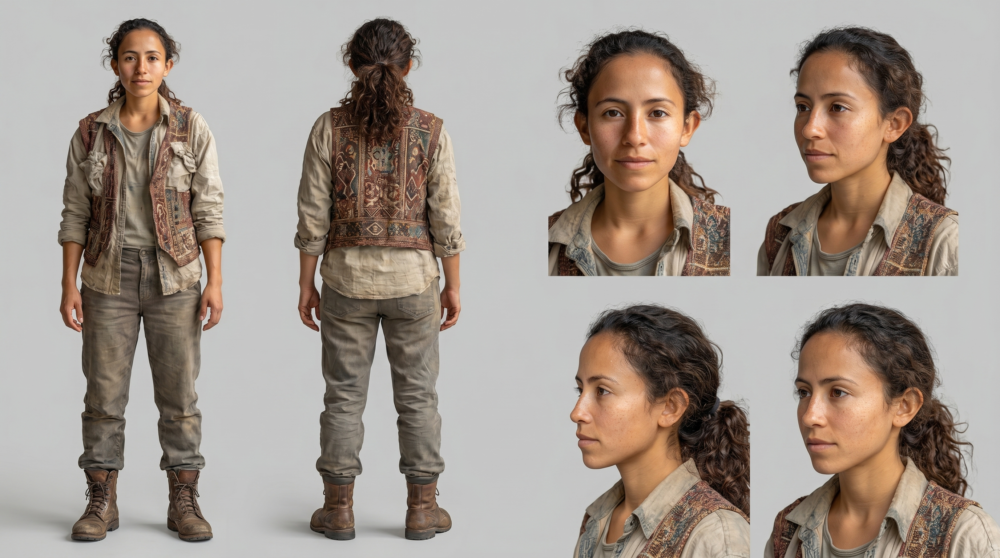
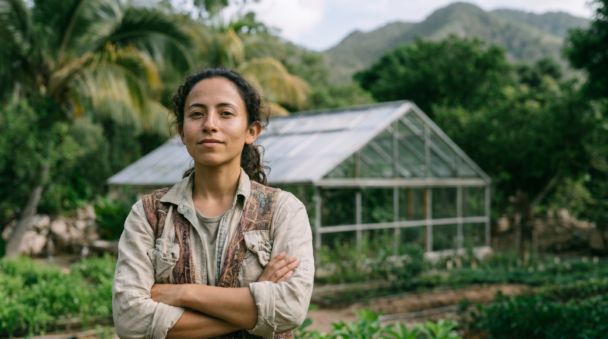

```text
Midjourney
├── Character reference ──→ NBP Character Sheet ──┐
└── Environment reference ─────────────────────────┤
                                                   ↓
                                             NBP Composite
                                                   ↓
                                            Image-to-Video
```

# Creation Workflow

The video was built through a four-stage image-to-video workflow, separating character development, environment design, compositing, and motion generation.

## 1. Character + Environment Development — Midjourney

The goal was to establish the overall visual identity, without trying to solve the final shot immediately.

→ `female-lead.md`



→ `greenhouse.md`




## 2. Character Consistency — Nano Banana Pro

This provided a more consistent visual reference for the character across different angles and compositions before integrating her into the final environment.

→ `female-lead-character-sheet.md`




## 3. Compositing — Nano Banana Pro

At this stage, prompting focused less on character design and more on composition, scale, placement, lighting integration, and preserving the visual identity established in the previous steps.

→ `compositing.md`




## 4. Motion — Image-to-Video

The resulting composite became the visual reference for video generation.

Video prompts focused primarily on camera movement, character action, environmental motion, and preserving continuity with the source frame rather than redesigning the image.

→ `video-prompt.md`

